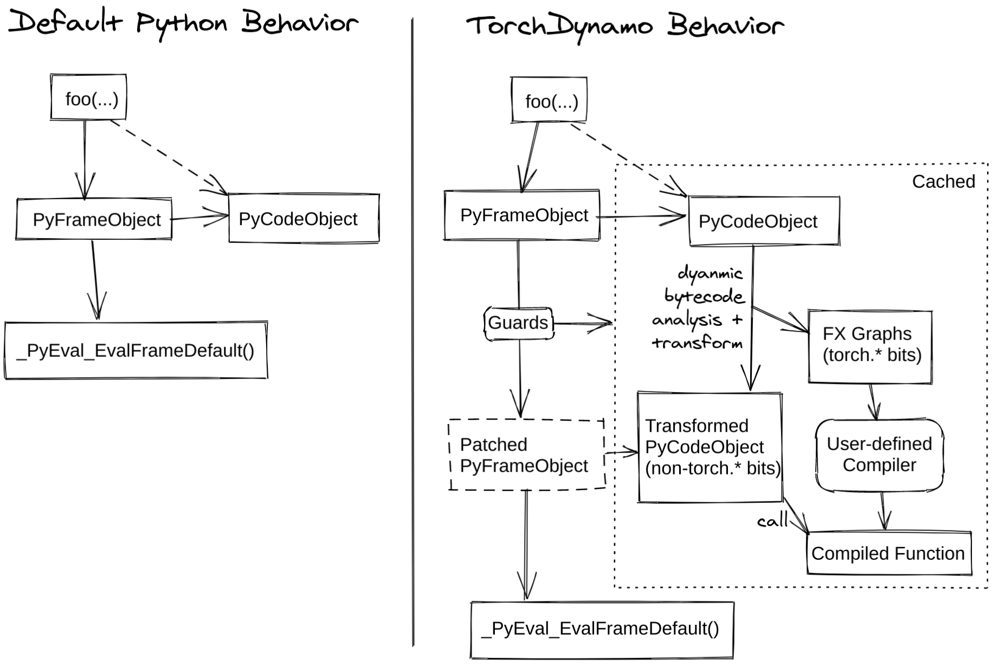

# TorchDynamo

This is an early experiment into using [PEP 523] to expose fusion opportunities in PyTorch. It dynamically rewrites
Python bytecode in order to extract sequences of PyTorch operations into an [FX Graph]
which is just in time compiled with a user-defined compiler. It creates this FX Graph through bytecode analysis, and is
designed to generating smaller graph fragments that can be mixed with Python execution.   The name is a reference/homage to [DynamoRIO], which dynamically translates machine code.

For more information see progress updates posted on dev-discuss.pytorch.org:
- [TorchDynamo: An Experiment in Dynamic Python Bytecode Transformation](https://dev-discuss.pytorch.org/t/torchdynamo-an-experiment-in-dynamic-python-bytecode-transformation/361)
- [TorchDynamo Update: 1.48x geomean speedup on TorchBench CPU Inference](https://dev-discuss.pytorch.org/t/torchdynamo-update-1-48x-geomean-speedup-on-torchbench-cpu-inference/397)




[PEP 523]: https://www.python.org/dev/peps/pep-0523/
[FX Graph]: https://pytorch.org/docs/stable/fx.html
[DynamoRIO]: https://dynamorio.org/

## Requirements

Python 3.8 is highly recommended.  Python 3.7 works, but is only
sporadically tested and has lower coverage.  Other python versions
are untested.

For running TorchBench, use the latest version and apply [this
patch](https://github.com/pytorch/benchmark/pull/564) if it has not yet
been merged upstream.

## Initial Development Setup

```
git clone git@github.com:pytorch/benchmark.git torchbenchmark
cd torchbenchmark
env PYTHON_VERSION=3.8 ./scripts/recreate_conda_environment.sh
cd ..

git clone git@github.com:jansel/torchdynamo.git
cd torchdynamo
conda activate torchbenchmark
make setup
python setup.py develop  # compiles C/C++ extension
pytest  # run tests
```

## Tests and Measurement

*Run all tests with:*

```
conda activate torchbenchmark  # if not activated already
make test
```

*Run all torchbench models with:*

```
conda activate torchbenchmark  # if not activated already
make torchbench
```

The `torchbench.py` script contains many options for working with torchbench models:

- `./torchbench.py` will measure operator coverage
- `./torchbench.py --overhead` will measure overheads (without doing any optimizations)
- see `./torchbench.py --help` for options

## Development workflow

Tests set `torchdynamo.config.debug = True`, which triggers useful printouts if you add the `-vs` option when running tests.

For example, to look deeper into what this test is doing:

```
@make_test
def test_viatorch(a, b):
    return torch.sub(a, b)
```

run it with:

```
python setup.py develop && pytest -vsk test_viatorch
```

which prints out:

```
...

fx.symbolic_trace graph:
opcode         name    target                                                  args    kwargs
-------------  ------  ------------------------------------------------------  ------  --------
placeholder    a       a                                                       ()      {}
placeholder    b       b                                                       ()      {}
call_function  sub     <built-in method sub of type object at 0x7f4e1b80f920>  (a, b)  {}
output         output  output                                                  (sub,)  {}

__compiled_fn_0
opcode         name    target                                                  args        kwargs
-------------  ------  ------------------------------------------------------  ----------  --------
placeholder    a_0     a_0                                                     ()          {}
placeholder    b_1     b_1                                                     ()          {}
call_function  sub     <built-in method sub of type object at 0x7f4e1b80f920>  (a_0, b_1)  {}
output         output  output                                                  (sub,)      {}

ORIGINAL BYTECODE
116           0 LOAD_GLOBAL              0 (torch)
              2 LOAD_METHOD              1 (sub)
              4 LOAD_FAST                0 (a)
              6 LOAD_FAST                1 (b)
              8 CALL_METHOD              2
             10 RETURN_VALUE

MODIFIED BYTECODE
114           0 LOAD_GLOBAL              2 (__compiled_fn_0)
              2 LOAD_FAST                0 (a)
              4 LOAD_FAST                1 (b)
              6 CALL_FUNCTION            2
              8 RETURN_VALUE


GUARDS:
 - local 'a' TYPE_MATCH
 - local 'b' TYPE_MATCH
 - global 'torch' FUNCTION_MATCH
```

this output contains:

1) The FX graph captured by `fx.symbolic_trace()` (for baseline comparison)
1) The FX graph generated by TorchDynamo
1) The Python bytecode of the original function
1) The modified Python bytecode generated by TorchDynamo
1) The guards generated to check if the generated code is valid

A useful (test driven development) workflow when adding a feature is:

1) Add a test for the behavior you want to add
1) Run the test with `pytest -vsk <test_name>`
1) Fix issues
1) Go to step 2

## Linting and automatic code formatting

This project is auto-formatted with [black](https://github.com/psf/black)
and [clang-format](https://clang.llvm.org/docs/ClangFormat.html).

- `pip install flake8 black` first, then:
- `make format` to reformat all files
- `make lint` to run linters
